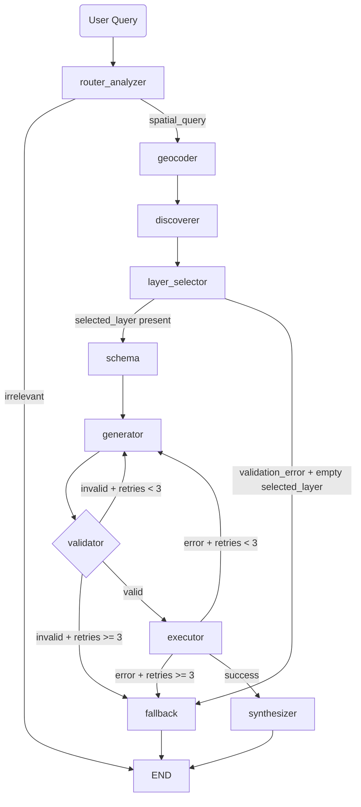

# Provider-Agnostic GeoServer ECQL Agent

Backend AI agent that converts natural language into GeoServer ECQL, validates the query against live WFS schema, executes it, and returns grounded results.

The architecture is intentionally deterministic for critical steps:
- WFS capability and schema discovery
- Programmatic ECQL validation and retry loops
- Provider-agnostic LLM integration (via LiteLLM)

## Features

- FastAPI backend with health endpoint
- LangGraph orchestration (node-based workflow)
- Pydantic-based structured outputs and validation
- Geospatial stack with OWSLib, Shapely, and pyproj
- Environment-based model switching through CURRENT_MODEL, ROUTING_MODEL, and SYNTHESIZER_MODEL

## Tech Stack

- Python 3.12+
- FastAPI
- LangGraph
- LiteLLM
- Pydantic
- OWSLib
- Shapely
- pyproj
- httpx

## Project Structure

    ecql-agent/
    ├── app/
    │   ├── api/          # FastAPI routes
    │   ├── core/         # LLM wrapper and config
    │   ├── graph/        # LangGraph state, nodes, builder
    │   └── tools/        # Deterministic WFS and spatial tools
    ├── .env.example
    ├── main.py           # FastAPI entry point
    ├── pyproject.toml
    ├── uv.lock
    └── SYSTEM_DESIGN.md

## Prerequisites

- Python 3.12+
- uv installed
- Optional: Docker (for local GeoServer)

## Getting Started

1. Clone the repository.
2. Enter the project directory.
3. Install dependencies:

```bash
uv sync
```

4. Create environment file from template:

Linux/macOS:

```bash
cp .env.example .env
```

Windows PowerShell:

```powershell
Copy-Item .env.example .env
```

5. Update values in .env as needed.
6. Start the API server:

```bash
uv run uvicorn main:app --reload
```

7. Verify server health:

```text
GET http://127.0.0.1:8000/health
```

Expected response:

```json
{"status":"ok"}
```

## SSE Contract for Frontend

Endpoint:

```text
POST /api/spatial-chat
Content-Type: application/json
```

Request body:

```json
{
  "query": "Find hospitals in Berlin",
  "thread_id": "123"
}
```

Response is streamed as `text/event-stream` with named SSE events.

Status event (stream started):

```text
event: status
data: {"thread_id":"123","status":"starting"}
```

Update event (graph node/state update):

```text
event: update
data: {"thread_id":"123","update":{"schema":{"geometry_column":"the_geom"}}}
```

Final event (normalized UI payload):

```text
event: final
data: {"thread_id":"123","final_response":{"summary":"Found 2 matching features.","geojson":{"type":"FeatureCollection","features":[]}}}
```

For non-spatial chat or fallback paths, `geojson` is always present as `null`.

Done event (stream completed successfully):

```text
event: done
data: {"thread_id":"123","status":"completed"}
```

Error event (stream failed):

```text
event: error
data: {"thread_id":"123","status":"failed","message":"boom"}
```

## Environment Variables

Example values in .env.example:

- CURRENT_MODEL="gpt-4.1"
- CURRENT_MODEL="gemini-2.0-flash" (also supports fully-qualified `gemini/gemini-2.0-flash`)
- ROUTING_MODEL="gpt-4o-mini" (used by router_analyzer)
- SYNTHESIZER_MODEL="gpt-4o-mini" (used by synthesizer)
- LLM_BASE_URL="" (optional: custom provider base URL, uses LiteLLM/provider default when empty)
- LLM_API_KEY="" (used when LLM_BASE_URL is set)
- GEOSERVER_WFS_URL="http://localhost:8080/geoserver/wfs"
- GEOSERVER_WFS_USERNAME=""
- GEOSERVER_WFS_PASSWORD=""
- GEOSERVER_WFS_SRS_NAME="EPSG:3857"
- GEOCODER_API_URL="https://stargate-cetus.prod.tardis.telekom.de/geo"
- GEOCODER_TOKEN_URL="https://.../oauth/token"
- GEOCODER_CLIENT_ID=""
- GEOCODER_CLIENT_SECRET=""
- GEOCODER_SCOPE=""
- OPENAI_API_KEY=""
- ANTHROPIC_API_KEY=""
- GEMINI_API_KEY=""

Notes:
- When LLM_BASE_URL is set, configure LLM_API_KEY for the custom endpoint.
- When LLM_BASE_URL is empty, configure the provider-specific key for CURRENT_MODEL (OPENAI_API_KEY / ANTHROPIC_API_KEY / GEMINI_API_KEY).
- Keep .env local and do not commit secrets.
- The geocoder integration uses OAuth2 client credentials flow; provide token URL, client ID, and client secret.
- `GEOSERVER_WFS_SRS_NAME` is used as `srsName` in final WFS GetFeature requests.

## Architecture Overview

The following diagram illustrates the high-level flow of the backend system:



## Development

- Entrypoint: main.py
- Virtual environment: managed by uv in .venv

Run tests:

```bash
uv run pytest -q
```

## Reference

- See SYSTEM_DESIGN.md for full architecture details.
