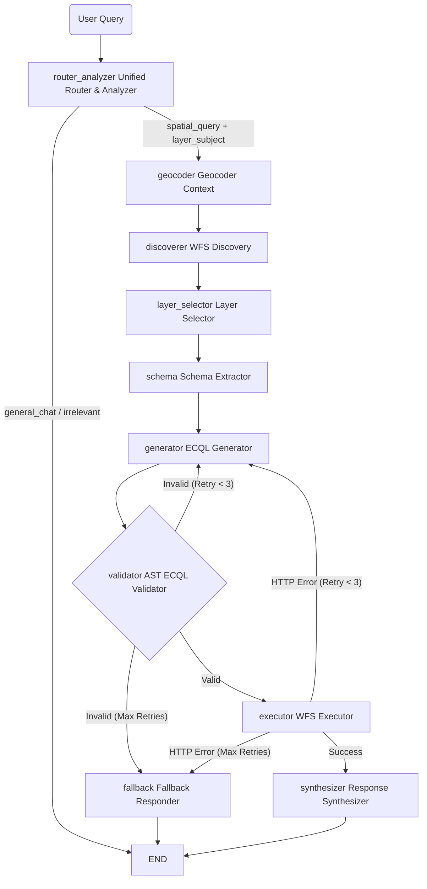

# Backend System Design: Provider-Agnostic GeoServer ECQL Agent

## 1. Core Technology Stack
*   **Environment & Package Manager:** `uv`
*   **API Framework:** FastAPI
*   **Agent Orchestrator:** LangGraph
*   **LLM Provider-Agnostic Layer:** `LiteLLM` + `Pydantic` (Strict structured outputs)
*   **Geospatial & OGC Tooling:**
    *   `OWSLib` (WFS GetCapabilities & DescribeFeatureType parsing)
    *   `pygeofilter` (AST parsing for deterministic ECQL validation)
    *   `httpx` (Sync HTTP client for Telekom Geocoding API and WFS GetFeature)
    *   `shapely` / `pyproj` (Geometry and CRS management)

## 2. Agent State Definition
The `AgentState` is a `TypedDict` passed through the graph. It holds the decomposed spatial intent and the dynamically fetched GeoServer schemas.

```python
from typing import TypedDict, Dict, Any, Optional, List

class FinalResponsePayload(TypedDict):
    summary: str
    geojson: Optional[Dict[str, Any]]

class AgentState(TypedDict):
    user_query: str
    
    # 1. Unified Router Outputs
        intent: str                         # "spatial_query", "general_chat", "irrelevant"
    final_response: Optional[FinalResponsePayload]  # Always object: summary + geojson (nullable)
    spatial_reference: Optional[str]    # e.g., "Berlin"
    spatial_relationship: Optional[str] # e.g., "within 5km"
    layer_subject: Optional[str]        # e.g., "hospitals"
    attribute_hints: List[str]          # e.g., ["capacity > 100"]
    
    # 2. Resolved Spatial Context
    spatial_context: Optional[Dict[str, Any]]  # {"bbox": [minX, minY, maxX, maxY], "result": dict, "query": str}
    
    # 3. GeoServer Context
    available_layers: List[Dict]
    selected_layer: str
    layer_schema: Dict[str, str]
    geometry_column: str
    
    # 4. Execution State
    generated_ecql: str
    validation_error: Optional[str]
    retry_count: int
    
    # 5. Results
    wfs_request_url: str
    wfs_result: Dict[str, Any]          # GeoJSON
```

## 3. Agent Graph Workflow



## 4. Core Node Implementations

### A. Unified Router & Analyzer
*   **Function:** Reads the prompt, determines intent, and decomposes the spatial entities in a single step using a Pydantic schema (`AnalyzedIntent`).
*   **System Context Injection:** Injects "Current location is Germany. Current year is 2026." to resolve relative queries.
*   **Output contract:** For `general_chat` and `irrelevant`, writes `final_response` as `{summary, geojson: null}` for a UI-ready terminal payload.
    *   **Intent values:**
        *   `spatial_query` — user wants map/layer data
        *   `general_chat` — greetings/conversation
        *   `irrelevant` — not a spatial query or chat (e.g., off-topic)

### B. Geocoder Node
*   **Function:** If `spatial_reference` is not null, calls the Telekom Geocoding API via `httpx.Client` to resolve location data and derive the BBOX.

### C. WFS Layer Discoverer & D. Schema Extractor
*   **Function:** Uses `layer_subject` as the primary selector over cached WFS Capabilities.
    *   Deterministic prefilter searches layer `name`, `title`, and `abstract`.
    *   If exactly one match is found, it is selected directly.
    *   If multiple matches are found, LLM is used only as a tie-breaker over the filtered subset.
    *   If no match is found, selection falls back to LLM over the full discovered layer list.
*   **Caching:** WFS GetCapabilities discovery is cached for 12 hours (success-only caching), keyed by WFS URL + auth identity + timeout.
*   **Schema Extraction:** Executes `DescribeFeatureType` via `OWSLib` to strictly define `layer_schema` and `geometry_column`.

### E. ECQL Generator
*   **Function:** Generates the ECQL string. Is fed the exact `layer_schema`, the `spatial_context_bbox`, and the bulleted `attribute_hints` extracted in Step A.

### F. AST ECQL Validator (Guardrail Node)
*   **Function:** Uses `pygeofilter` to parse the ECQL.
*   **Logic:** Proves syntactic validity, verifies every referenced attribute exists in `layer_schema`, and ensures spatial predicates use the exact `geometry_column`. Passes errors back to Step E for self-correction.

### G. Response Payload Normalization
*   **Function:** Terminal nodes always produce a normalized `final_response` object with two fields:
    *   `summary` — user-friendly language output
    *   `geojson` — GeoJSON object for UI map rendering, or `null` when unavailable
*   **Guarantee:** The backend always tries to include request-appropriate GeoJSON in the final payload. For non-spatial or fallback cases, `geojson` remains explicitly `null`.

---
---


# 7-Phase Implementation Plan

### Phase 1: Project Initialization (`uv` Workflow)
- [x] **Initialize Project:**
    ```bash
    uv init geoserver-agent
    cd geoserver-agent
    ```
- [x] **Add Dependencies:**
    ```bash
    uv add fastapi uvicorn pydantic pydantic-settings langgraph litellm owslib shapely pyproj httpx pygeofilter
    ```
- [x] **Environment Setup (`.env`):**
    ```env
    OPENAI_API_KEY=sk-your-key
    CURRENT_MODEL=gpt-4o
    GEOSERVER_WFS_URL=http://localhost:8080/geoserver/wfs
    GEOCODER_API_URL=
    GEOCODER_TOKEN_URL=https://<oauth-provider>/oauth2/token
    GEOCODER_CLIENT_ID=<client-id>
    GEOCODER_CLIENT_SECRET=<client-secret>
    GEOCODER_SCOPE=<optional-scope>
    ```

### Phase 2: Build Deterministic Geospatial Tools
*Create pure Python modules in `app/tools/`.*
- [x] **`geocoder.py`:** Implement a custom Telekom geocoder client with OAuth2 client-credentials token retrieval and cached token reuse, using sync `httpx.Client` calls.
- [x] **`wfs_client.py`:** Implement functions using `OWSLib` to fetch capabilities, extract schemas (`DescribeFeatureType`), and execute WFS HTTP GET requests (enforcing `count=1000`). Add deterministic `layer_subject` filtering and GetCapabilities cache (12-hour TTL, success-only).
- [x] **`ecql_validator.py`:** Write the AST parser function using `pygeofilter`. Traverse the AST to check attributes against the dictionary schema. Return `(is_valid: bool, error_msg: str)`.

### Phase 3: The Provider-Agnostic LLM Layer
*Create schemas and LLM wrappers in `app/core/`.*
- [x] **`schemas.py`:** Define the `AnalyzedIntent` Pydantic model (for the Router) and the `ECQLGeneration` model.
- [x] **`llm.py`:** Write the `invoke_llm(messages, output_schema)` function using LiteLLM to handle the structured outputs seamlessly across model providers.

### Phase 4: Define LangGraph Nodes
*Create the node functions in `app/graph/nodes.py`.*
- [x] **`unified_router_analyzer_node` (`router_analyzer`):** Injects system context (Date/Location). Calls `invoke_llm` with `AnalyzedIntent`. Updates state with intent, chat response, and spatial entities.
- [x] **`geocoder_context_node` (`geocoder`):** Only executes API call if `spatial_reference` is populated.
- [x] **`wfs_discovery_node` + `layer_discoverer_node`:** Discover available layers from cached capabilities and apply layer selection strategy: deterministic `layer_subject` prefilter first, then LLM tie-break when needed.
- [x] **`schema_extractor_node` (`schema`):** Pure Python call to `wfs_client.py`. Updates state with valid schema dict.
- [x] **`ecql_generator_node` (`generator`):** Calls LLM. Prompts it with the extracted `attribute_hints` and strict `layer_schema`.
- [x] **`ecql_validation_node` (`validator`):** Calls `ecql_validator.py`. If invalid, updates `validation_error`.
- [x] **`wfs_executor_node` (`executor`) + `fallback_node` (`fallback`) + `synthesizer_node` (`synthesizer`):** Execute WFS, handle retries/failures, and summarize the final WFS GeoJSON payload.

### Phase 5: Orchestrate the Graph
*Tie it together in `app/graph/builder.py`.*
- [x] **Initialize Graph:** `builder = StateGraph(AgentState)`. Add all nodes.
- [x] **Unified Routing Edge:**
    ```python
    def route_after_analysis(state: AgentState):
        if state["intent"] == "spatial_query" and state.get("layer_subject"):
            return "geocoder"
        return "end"
    builder.add_conditional_edges("router_analyzer", route_after_analysis)
    ```
- [x] **Validation Retry Edge:**
    ```python
    def validator_router(state: AgentState):
        if state.get("validation_error") and state["retry_count"] < 3:
            return "generator"
        if state.get("validation_error"):
            return "fallback"
        return "executor"
    builder.add_conditional_edges("validator", validator_router)
    ```
- [x] **Compile:** `graph = builder.compile()`.

### Phase 6: API & Streaming Layer
*Expose the agent in `main.py` and `app/api/routes.py`.*
- [x] **FastAPI Setup:** Initialize the app and CORS middleware.
- [x] **Endpoint:** Create `POST /api/spatial-chat`.
- [x] **Streaming:** Use `async for event in graph.astream(inputs, stream_mode="updates"):` to yield Server-Sent Events (SSE). Keep step-level `update` events unchanged for progress UIs, and append one normalized `final` event before `done` containing `final_response = {summary, geojson}`.

### Phase 7: Execution & Guardrail Testing
- [x] **Run Server:** `uv run uvicorn main:app --reload`
- [x] **Test Unified Router:** Send *"Hello, how are you?"*. Verify it bypasses all spatial tools and responds instantly.
- [x] **Test Relative Context:** Send *"Find hospitals near me"*. Verify the router defaults to Germany, extracts "Germany" as `spatial_reference`, and geocodes correctly.
- [x] **Test AST Guardrail:** Send a malformed attribute request. Verify `pygeofilter` catches the hallucinated column, triggers the conditional retry edge, and forces the LLM to rewrite the ECQL.
- [x] **Test Layer Selection Strategy:** Verify deterministic single-match `layer_subject` selection does not call LLM; verify multi-match uses LLM only on filtered candidates; verify no-match fallback uses full list.
- [x] **Test Capabilities Cache:** Verify repeated capability discovery within 12 hours reuses cache; verify TTL expiry refreshes discovery; verify failed discovery responses are not cached.