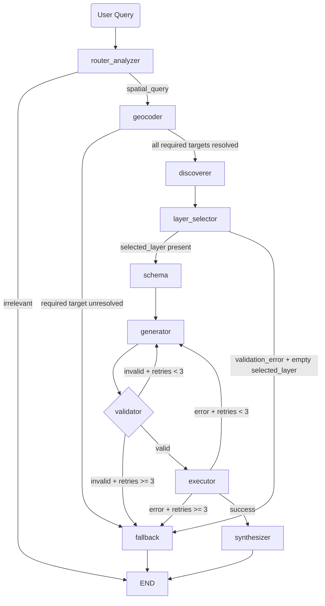

# Backend System Design: GeoServer ECQL Agent

## 1. Purpose
This backend receives natural-language spatial requests, resolves geospatial context, selects the correct GeoServer layer, builds and validates ECQL, executes WFS queries, and returns concise user-facing responses.

The architecture is async-first and uses a markdown layer catalog and semantic vector search for layer selection.

## 2. Core Stack
- Environment and package manager: uv
- API framework: FastAPI
- Orchestration: LangGraph
- LLM abstraction: LiteLLM + Pydantic structured outputs
- Semantic search: ChromaDB (in-memory) + jina-embeddings-v2-base-de
- Geospatial and OGC tooling:
  - OWSLib for WFS capabilities and schema fallback parsing
  - pygeofilter for AST-level ECQL validation
  - shapely and pyproj for geometry and CRS handling
  - httpx AsyncClient for geocoder and WFS HTTP requests

## 3. High-Level Flow

## 4. Layer Selection Strategy (Semantic Search + Markdown Catalog)
### 4.1 Catalog lifecycle
- Source of truth: WFS GetCapabilities discovery.
- Catalog format: enriched markdown with layer id, DE and EN metadata, aliases.
- Persistence: stored on disk at layer_catalog_markdown_path.
- Staleness policy: refreshed when older than layer_catalog_stale_after_hours (default 8).
- On application startup, layers are discovered, the markdown catalog is built, and all layers are indexed into the in-memory vector store. Embeddings are generated via the configured embedding_model through LLM_BASE_URL.

### 4.1.1 Translation hardening
- LLM translation prompt requires German and English fields to differ, with inline few-shot examples.
- `_has_translation_occurred(row)` validator detects rows where `de_title == en_title` and `de_abstract == en_abstract`.
- After the initial LLM merge, untranslated rows trigger a targeted repair LLM pass (best-effort; failure preserves first-pass output).
- Every row carries a `translation_verified: bool` flag: `True` if DE/EN fields differ, `False` for fallback rows where they are identical.
- Fallback rows (used when the LLM call fails entirely) are explicitly marked with `translation_verified: False`.

### 4.2 Selection behavior
- Primary: semantic vector search using ChromaDB and jina-embeddings-v2-base-de.
  - Each layer is embedded as a rich text document combining: layer name, DE/EN titles, DE/EN abstracts, and aliases.
  - At query time, the query text is embedded and a cosine similarity search returns the top candidates.
  - Produces `retrieval_top_score` (best match 0.0–1.0) and `retrieval_score_gap` (gap between rank-1 and rank-2).
- If the semantic index is unavailable, the node returns a low-confidence validation error and does not execute LLM layer selection.
- Early-exit gate: if `retrieval_top_score < min_retrieval_score` (configurable, default 0.15), the node returns a fallback response immediately without calling the LLM.
- Only the top `max_llm_candidates` (configurable, default 10) layers are passed to the LLM prompt, reducing token usage.
- The layer selector prompt receives:
  - user query
  - parsed layer subject
  - full markdown catalog content
  - top-N candidate layer-name allowlist
- Model returns:
  - layer_name
  - confidence (high, medium, low)
  - reasoning (short explanation of why this layer was selected)
  - score (LLM-expressed 0–1 confidence)
- Guardrails:
  - if selected layer is not in discovered allowlist, selection fails
  - if confidence is low, selection fails
  - failure emits low-confidence validation_error and routes to fallback

### 4.3 Vector store details
- Backend: ChromaDB in-memory (ephemeral, no persistence across restarts).
- Embedding model: jina-embeddings-v2-base-de, accessed via the OpenAI-compatible embeddings endpoint at LLM_BASE_URL.
- Indexing: attempted at application startup after WFS discovery and catalog build.
- Runtime refresh: opportunistic refresh in discovery/selection path every `vector_reindex_hours` (default 24h).
- Recovery: if startup indexing fails, runtime requests can re-attempt indexing and recover without process restart.
- Document format per layer: `"Layer: {name} | Title DE: {de_title} | Title EN: {en_title} | Abstract DE: {de_abstract} | Abstract EN: {en_abstract} | Aliases: {aliases}"`
- Singleton: a module-level `LayerVectorStore` instance is shared across all requests.

## 5. API Contract and State Model
### 5.1 Spatial parsing contract (non-backward-compatible)
The analyzer emits only id-bound spatial structures:

- spatial_targets: list of target definitions
  - id: stable key, for example g1 or r1
  - kind: explicit_geometry or spatial_reference
  - value: WKT for explicit geometries, place text for references
  - role: primary_area, secondary_area, proximity_anchor, unspecified
  - crs: optional CRS hint for explicit geometry
  - required: if true, unresolved target fails request

- spatial_predicates: list of predicate bindings
  - id: stable key, for example p1
  - predicate: INTERSECTS, WITHIN, CONTAINS, DISJOINT, CROSSES, OVERLAPS, TOUCHES, DWITHIN, BEYOND
  - target_ids: one or more ids from spatial_targets
  - distance and units: optional for DWITHIN and BEYOND
  - join_with_next: AND or OR
  - required: if true, unresolved predicate target binding fails request

### 5.2 AgentState key fields
- Request and routing:
  - user_query
  - intent
  - final_response
- Spatial interpretation:
  - spatial_targets
  - spatial_predicates
  - spatial_contexts: resolved contexts with target_id, source, crs, bbox, geometry_wkt, geometry_type
  - unresolved_target_ids
- Layer context:
  - available_layers
  - layer_catalog_markdown
  - selected_layer
  - retrieval_mode
  - retrieval_top_score: semantic pre-ranking best score (0.0–1.0)
  - retrieval_score_gap: difference between rank-1 and rank-2 scores
  - retrieval_reason: diagnostic string with top candidate name, score, and gap
  - candidate_layers_for_llm_count: number of layers passed to LLM (0 if early-exit gate fired)
- Schema and query:
  - layer_schema
  - geometry_column
  - generated_ecql
  - validation_error
  - retry_count
- Execution output:
  - wfs_request_url
  - wfs_result
- Runtime dependencies and usage:
  - geocoder_http_client
  - wfs_http_client
  - aggregate_usage

## 6. Node Responsibilities
### 6.1 router_analyzer
- Parses intent.
- Emits id-bound spatial_targets and spatial_predicates.
- Produces irrelevant response immediately when applicable.

### 6.2 geocoder
- Resolves each spatial_target into spatial_contexts, preserving target_id.
- Uses DWITHIN and BEYOND bindings for deterministic per-target buffering.
- Filters spatial_predicates to only resolved target ids.
- If any required target or required predicate binding is unresolved, sets validation_error and routes to fallback.

### 6.3 discoverer
- Discovers WFS layers from GetCapabilities (cached in tool layer with 12h TTL).
- Ensures markdown catalog is present and fresh.
- Provides both available_layers and layer_catalog_markdown.

### 6.4 layer_selector
- Pre-ranks available layers using semantic vector search (ChromaDB cosine similarity) against the query text.
- Attempts opportunistic semantic re-indexing if vector store is missing/stale.
- Gates on `min_retrieval_score`: if no layer scores above threshold, returns fallback without LLM call.
- Passes only top-N candidates (configurable via `max_llm_candidates`) to the LLM prompt.
- Populates `retrieval_top_score`, `retrieval_score_gap`, and `retrieval_reason` on every output.
- Sets `retrieval_mode` to `"semantic"`.
- Validates layer id and confidence from LLM response.
- Emits low-confidence error path when needed.

### 6.5 schema
- Fetches DescribeFeatureType and extracts attributes plus geometry column.

### 6.6 generator
- Builds spatial ECQL deterministically from resolved spatial_contexts plus id-bound spatial_predicates.
- Supports unary and multi-target predicate bindings.
- Honors join_with_next to compose AND or OR expression chains.
- Requests attribute-only ECQL from LLM.
- Merges spatial and attribute clauses into final ECQL.

### 6.7 validator
- Parses ECQL with pygeofilter.
- Validates composed spatial predicates and schema usage.
- Rejects non-constraining or invalid expressions.

### 6.8 executor
- Executes WFS GetFeature with bounded count and configured srsName.
- Returns result payload and request URL for traceability.

### 6.9 synthesizer
- Converts result feature set into concise natural-language summary.

### 6.10 fallback
- Produces user-safe terminal message for low-confidence layer mapping, unresolved required targets, and retry exhaustion paths.

## 7. API and Runtime Model
- Endpoint: POST /api/spatial-chat
  - Transport: Server-Sent Events with status, update, final, done events
- Endpoint: POST /api/layer-discovery
  - Standalone layer discovery reusing `wfs_discovery_node` + `layer_discoverer_node` behavior.
  - Request: `{ "query": "<natural language>" }`
  - Response: `{ layer_name, validation_error, retrieval_mode, retrieval_top_score, retrieval_score_gap, retrieval_reason }`.
  - Uses the same vector settings, confidence gate, and selection semantics as the main query pipeline.
- HTTP clients: pooled AsyncClient instances attached to app lifespan and injected into state
- Startup: application lifespan discovers WFS layers, builds markdown catalog, and indexes all layers into the vector store.

## 8. Configuration
Key environment-driven settings:
- current_model and provider API keys
- geoserver_wfs_url, geoserver_wfs_username, geoserver_wfs_password
- geoserver_wfs_srs_name
- layer_catalog_markdown_path
- layer_catalog_stale_after_hours
- min_retrieval_score: semantic/fuzzy matching threshold below which LLM selection is skipped (default 0.15)
- max_llm_candidates: maximum number of pre-ranked layers sent to the LLM selector (default 10)
- embedding_model: embedding model for semantic search (default jina-embeddings-v2-base-de)
- vector_store_top_k: number of results returned from vector search (default 8)
- vector_reindex_hours: runtime semantic index refresh interval (default 24)
- geocoder OAuth and API URLs

## 9. Validation and Reliability
- Retry loops:
  - validator failure retries generator up to 3 attempts
  - executor HTTP failure retries generator up to 3 attempts
- Catalog resilience:
  - if catalog refresh fails, system falls back to basic markdown generation from discovered layers
- Selection resilience:
  - semantic vector search provides meaning-based matching even without keyword overlap
  - if vector store indexing fails at startup, runtime requests can re-attempt semantic indexing
  - early-exit gate prevents LLM calls when no layer plausibly matches the query
  - invalid or low-confidence layer selections never proceed to schema or execution
- Translation resilience:
  - if translation LLM call fails, fallback rows with identical DE/EN text are used
  - targeted repair pass attempts to fix untranslated rows; failure preserves first-pass output
  - `translation_verified` flag distinguishes genuine translations from fallback copies
- Spatial resolution resilience:
  - unresolved optional targets and predicates are skipped
  - unresolved required targets and predicates fail fast before discovery and execution

## 10. Current Limitations and Next Iterations
- Single-layer selection per request (no multi-layer joins yet)
- Limited interactive geometry workflows (drawn polygons and multi-step refinement not yet first-class)
- Binary target predicate bindings currently expand to independent layer-vs-target clauses; deeper target-to-target semantic operators can be added later
- Future extension candidates:
  - multi-layer orchestration
  - richer alias curation and domain ontologies
  - explicit user-guided disambiguation loop for close matches
  - larger multi-step geospatial workflows
    - layer specific queries