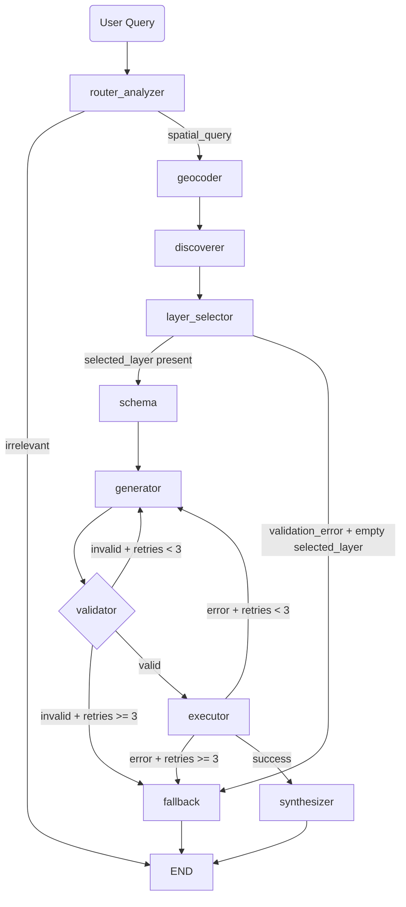

# Backend System Design: GeoServer ECQL Agent

## 1. Purpose
This backend receives natural-language spatial requests, resolves geospatial context, selects the correct GeoServer layer, builds and validates ECQL, executes WFS queries, and returns concise user-facing responses.

The current architecture is async-first and uses a markdown layer catalog (not vector embeddings) for layer selection.

## 2. Core Stack
- Environment and package manager: uv
- API framework: FastAPI
- Orchestration: LangGraph
- LLM abstraction: LiteLLM + Pydantic structured outputs
- Geospatial and OGC tooling:
    - OWSLib for WFS capabilities and schema fallback parsing
    - pygeofilter for AST-level ECQL validation
    - shapely and pyproj for geometry and CRS handling
    - httpx AsyncClient for geocoder and WFS HTTP requests

## 3. High-Level Flow

## 4. Layer Selection Strategy (Markdown Catalog)
### 4.1 Catalog lifecycle
- Source of truth: WFS GetCapabilities discovery.
- Catalog format: enriched markdown with layer id, DE and EN metadata, aliases.
- Persistence: stored on disk at layer_catalog_markdown_path.
- Staleness policy: refreshed when older than layer_catalog_stale_after_hours (default 8).

### 4.2 Selection behavior
- The layer selector prompt receives:
    - user query
    - parsed layer subject
    - full markdown catalog content
    - discovered layer-name allowlist
- Model returns:
    - layer_name
    - confidence (high, medium, low)
- Guardrails:
    - if selected layer is not in discovered allowlist, selection fails
    - if confidence is low, selection fails
    - failure emits low-confidence validation_error and routes to fallback

### 4.3 Why no vector DB
- Layer set is small enough to fit comfortably in prompt context.
- Full-catalog reasoning avoids embedding semantic loss in multilingual cases.
- Removes embedding model dependency and retrieval threshold tuning.

## 5. Agent State Contract
Agent state is a TypedDict passed across nodes. Key fields:

- Request and routing:
    - user_query
    - intent
    - final_response
- Spatial interpretation:
    - spatial_reference
    - spatial_filter
    - explicit_coordinates
    - explicit_bbox
    - spatial_context
- Layer context:
    - available_layers
    - layer_catalog_markdown
    - selected_layer
    - retrieval_mode
    - retrieval_top_score
    - retrieval_score_gap
    - candidate_layers_for_llm_count
- Schema and query:
    - layer_schema
    - geometry_column
    - generated_ecql
    - validation_error
    - retry_count
- Execution output:
    - wfs_request_url
    - wfs_result
- Runtime dependencies and usage:
    - geocoder_http_client
    - wfs_http_client
    - aggregate_usage

## 6. Node Responsibilities
### 6.1 router_analyzer
- Parses intent and structured spatial hints.
- Produces irrelevant response immediately when applicable.

### 6.2 geocoder
- Resolves location into normalized spatial_context:
    - crs
    - bbox
    - geometry_wkt
    - geometry_type
- Supports explicit bbox and explicit point shortcuts.
- Uses distance-aware buffering for DWITHIN and BEYOND.

### 6.3 discoverer
- Discovers WFS layers from GetCapabilities (cached in tool layer with 12h TTL).
- Ensures markdown catalog is present and fresh.
- Provides both available_layers and layer_catalog_markdown.

### 6.4 layer_selector
- Performs full-catalog LLM selection.
- Validates layer id and confidence.
- Emits low-confidence error path when needed.

### 6.5 schema
- Fetches DescribeFeatureType and extracts attributes plus geometry column.

### 6.6 generator
- Builds spatial ECQL deterministically from spatial context and filter.
- Requests attribute-only ECQL from LLM.
- Merges both parts into final ECQL.

### 6.7 validator
- Parses ECQL with pygeofilter.
- Verifies schema and geometry usage.
- Rejects non-constraining expressions.

### 6.8 executor
- Executes WFS GetFeature with bounded count and configured srsName.
- Returns result payload and request URL for traceability.

### 6.9 synthesizer
- Converts result feature set into concise natural-language summary.

### 6.10 fallback
- Produces user-safe terminal message for low-confidence layer mapping and retry exhaustion paths.

## 7. API and Runtime Model
- Endpoint: POST /api/spatial-chat
- Transport: Server-Sent Events with status, update, final, done events
- HTTP clients: pooled AsyncClient instances attached to app lifespan and injected into state

## 8. Configuration
Key environment-driven settings:
- current_model and provider API keys
- geoserver_wfs_url, geoserver_wfs_username, geoserver_wfs_password
- geoserver_wfs_srs_name
- layer_catalog_markdown_path
- layer_catalog_stale_after_hours
- geocoder OAuth and API URLs

## 9. Validation and Reliability
- Retry loops:
    - validator failure retries generator up to 3 attempts
    - executor HTTP failure retries generator up to 3 attempts
- Catalog resilience:
    - if catalog refresh fails, system falls back to basic markdown generation from discovered layers
- Selection resilience:
    - invalid or low-confidence layer selections never proceed to schema or execution

## 10. Current Limitations and Next Iterations
- Single-layer selection per request (no multi-layer joins yet)
- Limited interactive geometry workflows (drawn polygons and multi-step refinement not yet first-class)
- Future extension candidates:
    - multi-layer orchestration
    - richer alias curation and domain ontologies
    - explicit user-guided disambiguation loop for close matches
 
multiple spatial filter
geospatial query bigger than bigest
multi layer
- select layer as part of query
- improve retreival accuracy

use case:
genral one-shot query

- layer specific queries 
- interactive queries 